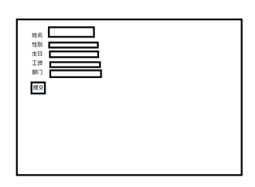

## 第十八天学习 11.27  
#### 一、复习  
#### 二、今日内容  
##### 1.  
```
server.use(bodyParse.urlendoded({
    extended:false
}));
urlencoded:可以将post请求的数据解析为对象  
extended:false 不使用第三方中的qs模块,而是使用核心模块querystring将数据解析为对象   
``` 
在路由中获取数据：  
req.body返回一个数据的对象格式  
浏览器向服务器端传递数据的方式：  
+ get req.query  
+ post req.body  
+ 路由传参 req.params  
##### 2.MySQL模块  
+ 增: INSERT INTO emp VALUES(NULL,'tom',)  
+ 删: DELETE FROM emp WHERE uid=5;   
+ 改: UPDATE emp SET uname='jerry',sex='1' WHERE uid=5;  
+ 查: SELECT * FROM emp ;  
(1)普通连接mysql  
var connection=mysql.createConnection({ });
创建连接对象，参数中传递mysql服务器的主机、端口、用户名、密码、选择使用的数据库。  
connection.connect();执行连接  
connection.query(sql,callback);sql表示要执行的sql语句，callback回调函数，用于获取sql语句的执行结果。  
connection.end();执行完所有的sql语句，关闭连接。  
(2)使用连接池连接  
var pool=mysql.createPool({});创建连接池对象,需要提供服务器的主机、端口、用户名、密码、使用的数据库，以及设置连接池的大小(connectionLimit)。  
pool.query(sql,callback);执行SQL语句，sql是执行的语句，callback是获取sql语句的执行结果。  
练习：删除编号为5的员工的信息，查看结果；修改编号为7的员工的姓名为'张三',生日为'1980-5-1'，查看结果。  
练习：创建web服务器，托管一个静态资源到public下，在该目录下创建一个add.html,点击提交按钮，向服务器发送请求(/add,post)  [add.html](public/add.html)&emsp;[05_add.js](05_add.js)  
课后任务：  
+ (1)复习今天的内容，整理思维导图。  
+ (2)往数据库中插入员工信息 tedu下emp表  
