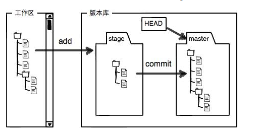
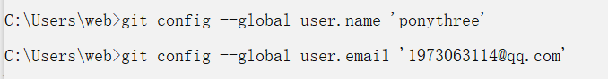
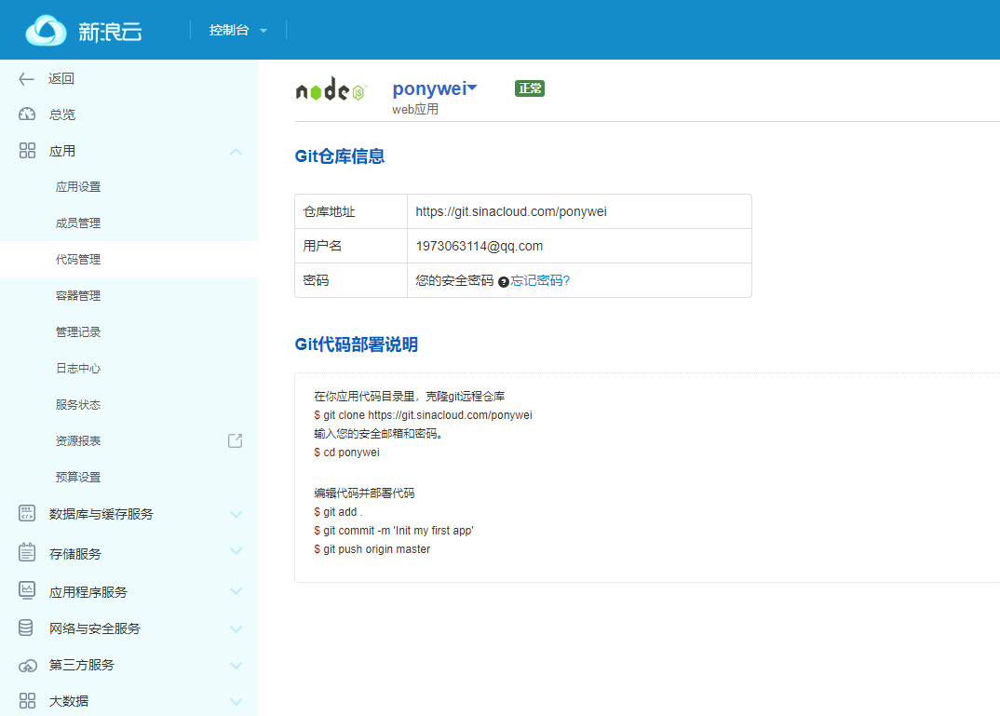
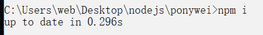
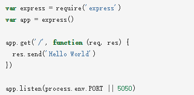

## 第二十天学习 11.27 (李文华串讲)  
+ 云服务器  
+ 上传自己的代码  
+ git  
+ 使用github.com  
#### 1.云服务器  
自己搭建私有服务器：费用昂贵   
租用云服务器： 费用划算、维护成本低  
主流云服务器提供商:AWS、阿里云、新浪云  
#### 2.使用新浪云服务器  
(1)注册新浪微博账号    
官网:weibo.com
(2)使用新浪微博绑定新浪云账号     
官网：sae.sina.com.cn   
(3)登录新浪云开通云应用，获得免费域名   
官网：sae.sina.com.cn    
(4)管理云应用，上传自己的代码    
如果创建的是PHP服务器，直接在版本库中上传代码文件即可  
如果创建的是Node.js服务器，需要使用git客户端上传代码
(5)客户端访问测试     
扩展知识：  
一级域名： .com  .cn  无法购买
二级域名: jd.com  tmooc.cn  万网(net.cn)  
三级域名： ponywei.applinzi.com  无需购买    
#### 3.在新浪云中使用数据库  
控制台->数据库与缓存服务->共享型Mysql   
提示：(1)共享型MYSQL中每个用户有且只有一个默认数据库，不允许删除或者创建新的库，即禁用CREATE DATABASE/DROP DATABASE!  
(2)共享型Mysql服务器的主机地址、端口、用户名、密码与上课都不一样，新浪云提供了一套常量！----注意查看手册    
#### 4.使用git来维护代码---重点&难点  
版本管理软件：用于记录软件的开发过程，实现团队成员的协作。实现代码的每一次提交人、提交时间、提交内容----每一次提交称为一个版本。 最终实现代码的存储、共享、追踪、回退等功能。  
常见的版本管理软件：CVS、SVN(Subversion)、Git   
GitKeeper  
Linus:Linux     
简单的Git教程：  
https://www.liaoxuefeng.com/wiki/0013739516305929606dd18361248578c67b8067c8c017b000  
版本管理软件的基本概念：  
+ Repository/Repo:仓库，一个项目所涉及到的所有文件以及每个文件的创建修改过程，称为仓库，即仓库=文件+历史。  
+ Commit:提交，每一次修改保存入仓库，称为提交。  
+ Workspace：工作区，程序员修改代码的地方，就是一个目录。    
+ Stage/Cache:缓存区/暂存区/舞台,用于临时性存储项目修改的内存区域。  
+ Clone:克隆,将远程Git仓库(文件+历史)复制一份到本地。  
+ Push:推送,将本地仓库中的所有内容 (文件+历史)复制到远程仓库。  
+ Pull:拉取,将远程Git仓库(文件+历史)的最新的修改更新到本地  
  
Git常用命令：    
(1)git config:配置Git的使用特性  
git config --global user.name  'ponythree'    
git config --global user.email '1973063114@qq.com'  

     
(2)git init:把当前目录初始化为一个Git仓库---整个项目的第一个项目，其他同事都克隆此仓库即可。  
(3)git status:查看当前的工作区/暂存区状态，有没有修改、增加、删除  
(4)git add:把工作区的修改添加到暂存区   
 git add 文件名   添加指定
 git add .          添加所有
(5)git commit :把暂存区的修改提交到仓库中，生成一个新的版本。  
git commit -m '提交的原因说明'    
<font color='red'>注意：</font>若没有提交-m以及原因说明，会自动进入vi编辑器，让用户输入。  
(6)git log:查看仓库中的提交日志(谁+时间+提交了什么)  
若进入vi编辑器：ESC->:q!    
练习：修改index.html中的内容，查看状态，添加到暂存区，最后提交到仓库。再次查看状态。  
删除css/index.css文件，查看状态，添加到暂存区，最后提交到仓库。再次查看状态。  
练习：修改index.html中的内容，后面追加两行内容，查看状态;添加到暂存区，最后提交到仓库。再次查看状态，查看仓库的提交历史。
```
Version:版本---每一次大的功能更新  

Revision:修订版、版本---每一次的修改提交  
```    
#### 5.使用git来维护新浪云中的代码   
    
说明：每一个新浪云中的云应用都对应一个git仓库，可以克隆仓库到本地，修改提交，最后推送本地仓库中的最新内容到远程仓库。  
+ 克隆云仓库到本地  
git clone 云仓库的地址  
+ 在本地工作区中修改项目文件    
+ 从本地工作区添加修改到暂存区    
git add .
+ 从本地暂存区提交到本地仓库中  
git commit -m "原因说明"
+ 将本地仓库最新历史推送到云仓库  
git push 云仓库的URL地址 ----主分支master   
当第一次提交认证输入错误时，促使不能再次认证，解决办法：  
控制面板\用户帐户\凭据管理器-----删除记录 
练习：把自己的新浪云仓库克隆到另一个目录下，修改index.html，添加两个img元素，同时在本地仓库添加这两个图片文件，添加/提交到本地仓库，推送到云仓库。  
   
   

  


