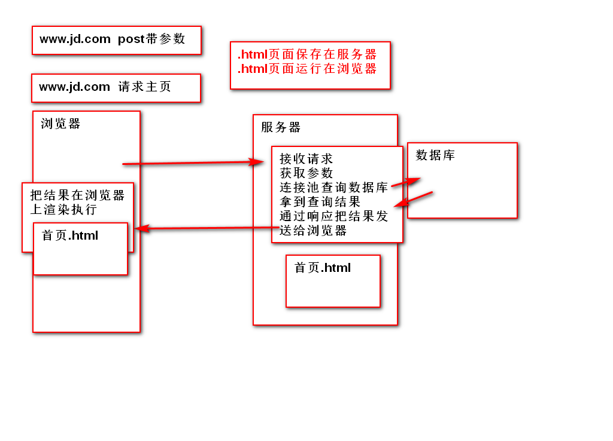

## 第二十一天学习  11.28   
### 一、课程安排   
+ 0.数据库+服务器(准备数据，准备服务器) 
+ 1.HTML5 Basic 2天+( 搭建网页结构，可以显示数据，很丑)  
+ 2.Ajax异步数据交互3天(前端页面和服务器的交互，为了得到数据在页面中显示)    
+ 3.Ajax项目 2天  
+ 4.CSS3 (样式表)4天+2天(负责给页面化妆，让页面变得好看)  
+ 5.Bootstrap 框架 4天  
+ 6.Bootstrap项目 3天  
面临的问题：  
(1)知识点细碎,没有条理  
(2)单词量巨大,关键词巨长  
(3)键速  
(4)笔记不要跟抄，练习要多敲  
浏览器与服务器之间的交互：  
#### 二、Web基础知识  
HTML5: HTML4.01升级版，大前端技术，泛指前端的所有技术。
HTML4.01在99年12月发布  
XHTML1.0在2000年1月发布，语法更严谨  
#### 1.web与Internet  
(1)Internet:全球性计算机互联网络  
俗称：互联网、因特网、交换网、交际网。  
www服务：world wide web (万维网),访问网站的服务  
BBS：电子公告板，俗称论坛  
Email：电子邮件  
telnet：远程登录  
FTP：文件的上传下载  
(2)web：Internet上的应用程序   
web的工作原理：   
 
<font color='red'>基于浏览器和服务器以及通信协议来实现数据的传输或展示</font>  
通信协议：规范数据是如何打包和传送的   
服务器的功能：存储数据，接收用户的请求并给出响应、提供程序的运行环境、具备一定的安全功能。  
(2)服务器产品：tomact(java)、Apache(php)、IIS(.net)   
(3)服务器的技术:PHP/JAVA/.NET/python/Node.js    
#### 2. Internet上的应用程序 
(1)C/S client客户端/server服务器    
(2)B/S Browser浏览器/server服务器  
C/S和B/S的区别：  
C/S需要升级  B/S不需要升级  
我们工作主要是B/S模式  
.html保存在服务器  
.html运行在浏览器 
#### 3、浏览器：  
(1)功能：  
代表用户发送请求  
作为HTML、css和js的解析器  
(2)浏览器产品
以图形化的方式解析渲染，展示给用户看  
Chrome、firefox、IE--Edge、Oprea、safari    
搜狗、猎豹、QQ、360  
(3)浏览器支持的技术  
H5、CSS、JS   

#### 三、HTML快速入门      
##### 1.什么是HTML  
<font color='red'>HTML:</font>HyperText Markup Language&emsp;<font color='red'>超文本标记语言 </font>  
```
a 普通文本  

<a></a>超文本标记   
``` 
标记：超文本的组成形式<关键字>具有自己的功能  
语言：有语法结构  
##### 2.HTML的特点  
(1)以.html或者.htm为后缀  
(2)由浏览器解析执行 
(3)用带有尖括号的"标记"识别  
(4)可以在网页中执行js脚本  
##### 3.HTML的基础语法   
标记、标签、元素、节点、对象 
主要是表示特殊的功能  
标记在使用的时候，必须使用< >包裹起来  
标记的分类：  
##### 3.1双标记(封闭类型)  
<关键字></关键字>  
双标记必须成对出现，有开始就有结束  
```  
<p></p>    
```
##### 3.2单标记 (非封闭类型)  
<关键字>或者</关键字>  
练习：创建一个text文档，名称为first.html  
在文档中写出标记  
写一对html标记  
一对head标记  
一对title标记  
##### 3.3语法  
```  
<关键字1>  
    <关键字2>  
        <关键字3></关键字3>  
    </关键字2>  
</关键字1>  
```  
##### 3.4属性和值  
允许通过属性和值对标记进行修饰  
语法：  
(1)属性和值必须声明在开始标记中  
```
<关键字 属性="值"></关键字>   
``` 
(2)多个属性之间用空格分开   
```
<关键字 属性1="值" 属性2="值2" ...></关键字>  
```  
(3)标准属性(通用属性)  
所有的元素都支持的属性 
+ id 定义此元素在页面中的唯一标识   
+ title 鼠标悬停在元素上时，显示的文本  
+ style css中，定义行内样式  
+ class css中，引用类型选择器   
学习HTML，就是学习固定关键字，学习此关键字作用。  
学习固定的标签属性，学习嵌套关系。  
(4)注释  
语法：  
```
<!--注释内容-->   

注意：注释不能嵌套注释，注释也不能出现在标记中。
```   
##### 3.5开发小技巧：
```  
1.标签只写完整的第一个，按tab补全  
2.属性如果拼写正确，会变色  
3.属性值可以不添加""和''，但是不推荐裸写值   
4.每次修改要记得保存  
5.页面刷新 F5   
``` 
#####  3.6快捷键：  
```  
windows +d 显示桌面  
windows+r 打开运行 
window+e 打开资源管理器  
alt+F4 关闭当前窗口    
ctrl +z 退回   
ctrl +y 前进 
ctrl +d 删除当前行  
ctrl + alt+ 下箭头  整行复制  
alt +下箭头 整行位移
```   
##### 7.添加Editplus快捷方式   

tools->首选项->keyboard->最右边load->打开1.key   
#### 四、HTML的文档的构成  
##### 1.文档类型声明   
<!DOCTYPE html>   
##### 2.网页的基本结构   
```
    <!DOCTYPE html>  
    <html>
        <head></head>  
        <body></body>  
    </html>  
    html表示网页的开头和结束  
    head网页的头部，定义全局的信息  
    body网页的主体,展示的内容
```     
##### 3.head元素是其他元素的容器<head></head>  
```
     <head> 
        <!-- 元数据，定义网页的全局信息 -->
        <meta charset="utf-8"/>
        <!-- 网页的标题 -->
        <title>我的第一个网页</title> 
        <!-- 元数据，定义网页的全局信息 -->
        <!-- 编码方式为utf-8方式，防止乱码-->    
        <!--chrome 62以上的版本，自动识别中文-->
        <meta charset="utf-8"/>
        <meta name="Keywords" content="关键字的内容">  
        <meta name="description" content="描述的内容">   
        <!-- 定义网页的内部样式--> 
        <style></style>  
        <!--定义或者引用js文件-->
        <script></script>  
        <!--引用外部样式文件-->  
        <link/>
	</head>
```  
##### 4.Body元素  
定义网页的主体  
body 的属性：  
bgcolor:背景颜色 
text:字体颜色  
取值:合法的颜色值-->颜色的英文单词  
练习：  
在01_ex中，把所有代码删除  
1.重新编写一遍，html的基本结构  
2.在head中添加网页标题，添加utf-8  
3.在body中添加任意文字，改变body的背景颜色和字体颜色  
red  green yellow black  white pink blue 
##### 5.文本标记   
##### 5.1标题元素  
作用：在页面中以醒目的方式显示文本  
5.1.1语法：  
```  
<h1></h1>  
<h2></h2>  
<h3></h3>   
...  
<h6></h6>   
``` 
5.1.2特点：  
+ 文本加粗  
+ 字号发生变化  
+ 独占一行，上下有垂直间距  
5.1.3属性：  
align设置标签内容水平对齐方式  
取值：left/center/right  
##### 5.2段落标记paragraph  
语法：   
``` 
<p></p>    
```
作用：突出表示一段文字    
特点：独立成行上下有垂直间距     
属性：align设置标签内容水平对齐方式  
练习：模拟个人简历   [练习](02_ex.html)
##### 5.3换行标记   
```
<br/>或者<br>    
```
##### 5.4水平线 (分割线)   
``` 
<hr>或者<hr/>    
```
width="50%"表示水平线的宽度，   
size="5px"表示水平线的尺寸(粗细),取值为%或者px为单位的数字  
align="left "对齐方式  
color="red"设置水平线的颜色  
##### 5.5预格式化  
```
<pre></pre>  
```  
标签内部的文本，保留其格式，在页面上显示  
<font color='red'>空格折叠现象：  
+ 一个或多个空格，会被浏览器渲染成一个空格显示。  
+ 一个或多个回车，会被浏览器渲染成一个空格显示  
</font>  
##### 5.6特殊字体(实体)  
```
   空格 &nbsp;   
   <p></p>是一个双标签，表示段落标签  
   < &lt;  less than  
   > &gt;   great than  
   ©  &copy;  
   ©  &reg;  
   ¥  &yen;  
   × &times;
```  
练习： Copyright© 2004-2018 <京东JD.com>版权所有  
p标签中输出上面的这句话[练习](02_ex.html)  
##### 5.7文本样式  
粗体 <b></b>  <strong></strong>  
斜体 <i></i>  <em></em>  
下划线 <u></u>  
删除线 <s></s>  <del></del> 语义化标签 
 <sup>上标
 <sub> 下标  
##### 5.8分区元素  
1.块分区，用于页面中布局 
语法：   
```
<div></div>  
```  
特点：  
独立成行  
2.行分区,处理同一行文本的不同样式  
语法：  
```
<span></span>  
```
特点：  
可以与其他的span和文字共用一行  
##### 5.9块级元素和行内元素 
1.块级元素 
在网页中，单独成行，就是块级元素  
从上往下排列  
常见的块级元素：  
h1~h6    
p   
div 
2.行内元素 (行级元素)  
在页面中，与其他行内元素/行内块共用一行  
从左往右  
页面中常见的行内元素  
i em b strong s del span sup sub   
3.行内块   
表现的方式与行内元素相同,但是具备块级元素的特征。  
4.table  
表格的宽高是由表格的内容决定的  
内容多，就宽一点，高一些  
表格中所有的数据都预读到内存，一次性画到页面上  
#### 六、图像和链接  
1.使用  
```  
或者  
```  
2.属性：  
src="路径" url--图片资源路径 
2.URL  
Uniform Resource Locator <font color="red">统一资源定位符</font> 简称：路径  
3.URL路径的表现形式   
+ 绝对路径：一个写完整的路径    
http://www.codeboy.com/img/index/banner4.png  
通信协议+主机地址+文件目录+文件的具体名称  
合适使用：  
(1)使用网络资源的时候，使用绝对路径   
图床： 
优点：不占据自己的服务器的存储空间  
缺点：不稳定  
练习：从tmooc上选取一张图，放到img中显示  
(2)使用本地资源，使用绝对路径(项目中100%用不到)  
从最高盘符开始查找 C/D/E/F/G  
项目中不可能用到  
(3)相对路径(参照物是html本身)  
+ 图片与html文件在同一目录下,src直接引用图片名称  
src="图片名称"  
#### 作业：  
1.Node.js服务器代码    
2.完成下图  
[练习](homework.html)
