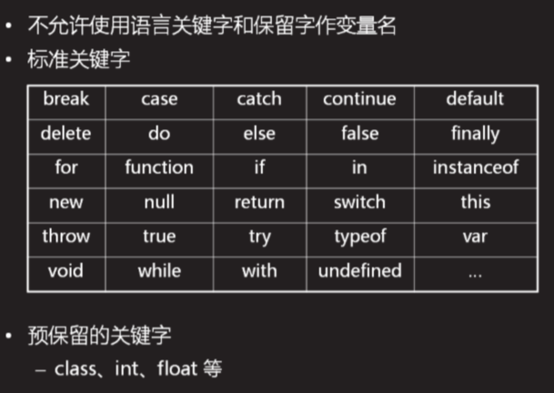

  
  
# 第五天学习 11.6  DQL复杂查询
## 复习    
### 1. 标准SQL语句分类    
+ <font color="#F66">DDL:Data Defined Language 定义数据语言</font>  
CREATE /DROP /ALTER(修改)    
+ <font color="#F66">DML:Data Manipulate Language 操作数据</font>    
INSERT/DALETE/UPDATE  
+ <font color="#F66">DQL:Data Query Language 查询数据</font>  
SELECT 
+ <font color="#F66">DCL: Data Control Language 控制用户权限  </font>  
GRANT(授权)/REVOKE(收权)  
     + GRANT ALL PRIVILEGES ON TABLE A,B TO U1,U2;  
    + REVOKE ALL PRIVILEGES ON TABLE A,B,C FROM U1,U2;  
    + REVOKE SELECT ON TABLE A FROM PUBLIC;  

&emsp;&emsp;&emsp;&emsp;&emsp;&emsp;&emsp;&emsp;&emsp;&emsp;&emsp;&emsp;&emsp;  

### 2.复杂查询  
(1)聚合查询  
```
聚合函数  
函数就是一个功能体,提供数据,查出结果。  ---------饺子机  
COUNT(...)数量    
SUM(...)求和  
AVG(...)求平均  
MAX(...)求最大  
MIN(...)求最小   
分组查询：只能查询分组的条件和聚合函数。 
``` 
示例：查询出所有员工的数量  
<font color="purple">SELECT <font color="red">COUNT(eid)</font> FROM emp;</font>  
<font color="purple">SELECT COUNT(*) FROM emp;</font> #推荐写法    
练习：使用员工的姓名这一列来查询员工数量   
<font color="purple">SELECT COUNT(ename) FROM emp; </font>   
练习：使用员工的部门编号这一列来查询员工数量  
<font color="purple">SELECT COUNT(DeptId) FROM emp;</font>  
练习：查询所有男员工的数量  
<font color="purple">SELECT COUNT(*) FROM emp WHERE sex=1; </font>   
练习：查询出所有员工的工资综合是多少  
<font color="purple">SELECT SUM(salary) FROM emp;</font>   
练习：计算所有员工的平均工资是多少？  
<font color="purple">SELECT SUM(salary)/COUNT(eid) FROM emp; </font>   
<font color="purple">SELECT AVG(salary) FROM emp;</font>  
练习：查询出工资最高的员工工资是多少  
<font color="purple">SELECT <font color="red">MAX(salary)</font> FROM emp;</font>  
练习：查询出工资最低的员工工资是多少  
<font color="purple">SELECT <font color="red">MIN(salary)</font> FROM emp;</font>  
练习：查询出年龄最大的员工是多少  
<font color="purple">SELECT MIN(birthday) FROM emp; </font> 
(2)分组查询  
示例：查询出每个部门的员工数量是多少？   
<font color="purple">SELECT deptId,COUNT(*) FROM emp GROUP BY deptId; </font>   
练习：查询男女的员工的平均工资、最高工资、最低工资是多少？  
<font color="purple">SELECT sex 性别,AVG(salary),MAX(salary),MIN(salary) FROM emp GROUP BY sex;</font>    
   

函数补充:  
+ <font color="red">YEAR(...)</font>获取日期中的年份  
+ <font color="red">MONTH(...)</font>获取日期中的月份  
+ <font color="red">DAY(...)</font>获取日期中的日     
    示例：查询出1991年出生的员工的所有信息   
    SELECT * FROM emp WHERE YEAR(birthday)="1991";    
    练习：查询出3月份出生的员工所有信息  
    SELECT * FROM emp WHERE MONTH(birthday)="3";  
    练习：查询出5号出生的员工所有信息  
    SELECT * FROM emp WHERE DAY(birthday)="5";     

(3)子查询  
<font color="orange">就是把一个SQL语句的查询结果作为另外一个SQL语句的查询条件</font>  
示例：查询出研发部所有的员工信息  
+ 步骤1：查询出研发部的部门编号---10    
<font color="blue">SELECT did FROM dept WHERE dname="研发部";</font>
+ 步骤2：根据研发部的部门编号查询员工信息   
<font color="blue">SELECT * FROM emp WHERE deptId=10; </font>    
综合：<font color="blue">SELECT * FROM emp WHERE deptId=(SELECT did FROM dept WHERE dname="研发部");  </font>  
练习：查询出比Tom工资高的员工所有信息    
步骤1：查询出Tom的工资是多少？ ----6000   
<font color="blue">SELECT salary WHERE ename="Tom";  </font>  
步骤2：查询出工资比6000高的员工的所有信息   
<font color="blue">SELECT * FROM emp WHERE salary>6000;  </font>  
综合： <font color="blue">SELECT * FROM emp WHERE salary>(SELECT salary FROM emp WHERE ename="Tom"); </font>  
练习：查询出和Tom同一年出生的员工信息     
步骤1：查询出Tom出生的年份是多少？---1990   
<font color="blue">SELECT YEAR(birthday) FROM emp WHERE ename="Tom";</font>   
步骤2：查询出出生年份为1990年的员工信息    
<font color="blue">SELECT * FROM emp WHERE YEAR(birthday)="1990"; </font>   
综合：<font color="blue">SELECT * FROM emp WHERE YEAR(birthday)=(SELECT YEAR(birthday) FROM emp WHERE ename="Tom");</font>  
(4)多表查询  
示例：查询出所有员工的姓名以及部门名称。  
<font color="blue">SELECT ename,dname FROM emp,dept; </font>   
<font color="red">错误：</font>产生笛卡尔积！    
多表查询如何避免产生笛卡尔积,添加查询条件  
<font color="blue">SELECT ename,dname FROM emp,dept WHERE deptId=did;</font>    
上述多表查询语法是SQL-92中，无法查询出没有部门的员工，也无法查询出没有员工的部门。  
SQL-99中提出了新的多表查询方法。  
+ 内连接   INNER JOIN... ON... 和SQL92结果一致   
<font color="blue">SELECT ename,dname FROM emp INNER JOIN  dept ON deptId=did;</font>    
+ 左外连接 LEFT OUTER JOIN... ON... 保证左边数据都显示   
<font color="blue">SELECT ename,dname FROM emp LEFT OUTER JOIN dept ON deptId=did; </font> (可省略OUTER)  
查询结果是左侧所有的记录都显示;OUTER可以省略  
+ 右外连接 RIGHT OUTER JOIN...ON...  保证右边数据都显示  
<font color="blue">SELECT ename,dname FROM emp RIGHT OUTER JOIN dept ON deptId=did;  </font>  
查询结果是右侧所有记录都显示；OUTER都可以省略  
+ 全连接 FULL JOIN 
显示左侧和右侧所有的记录---MySQL不支持    
<font color="red">UNION合并相同的项;  
UNION ALL 不合并相同的项; </font>   
SELECT ename FROM emp_us  
UNION  
(SELECT ename FROm emp_cn)   
  
(SELECT ename,dname FROM emp LEFT OUTER JOIN dept ON deptId=did)   
  UNION ALL 
(SELECT ename,dname FROM emp RIGHT OUTER JOIN dept ON deptId=did);  
  
(SELECT ename,dname FROM emp LEFT OUTER JOIN dept ON deptId=did)   
  UNION 
(SELECT ename,dname FROM emp RIGHT OUTER JOIN dept ON deptId=did);  
  
### 3.学习一门编程语言的基本步骤  
(1)了解背景知识：历史、现状、特点、应用场景。  
(2)搭建开发环境，编写hello world  
(3)变量和常量  
(4)数据类型  
(5)运算符  
(6)逻辑结构  
(7)通用小程序  
(8)函数和对象  
(9)第三方库、框架  
(10)实用的项目   
#### 3.1&emsp;JS 概述    
(1)历史  
1995年，JS最早出现在Netscape的浏览器中  
2009年，JS遵循CommonJS规范，开始向服务器端发展。   
(2)现状  
既可以运行在客户端浏览器，也可以运行在服务器端。  
(3)特点  
+ 解释性语言,编译一行执行一行。  
+ 弱类型语言,变量里面可以存储任何类型的数据。  
+ 基于对象    
+ 跨平台性,在手机端、电脑都可以使用。  
   
#### 4.JS的执行环境  
(1)浏览器自带的JS解释器   
(2)NODEJS下的JS解释器  
运行环境下载：  
[nodeJS下载地址](https://nodejs.org/en/download/)  
在命令行(win+r->cmd)下  node -v 查看系统中nodejs版本号    
(3)执行JS代码  
+ 浏览器下：创建一个01.js和01.html ，在01.html中引入01.js  
```
<script src="01.js"></script>
```  
+ nodeJS下：在node运行环境下,直接把01.js拖拽进去即可  
```
node C:\Users\web\Desktop\web1810\11.6\笔记练习\01.html
```
(4)JS代码规范  
+ 区分大小写  
+ 每行代码结束的分号可加不加，提倡都加  
+ 分为单行注释(//...)和多行注释(/*...*/)    
(5)变量   
变量就是用于存放数据的容器。   
x=1 y=2  
+ 声明变量使用关键字var  
```
   var a=1;      
``` 

&emsp;&emsp;&emsp;练习：声明多个变量，分别保存员工的编号、姓名、性别、生日、工资、部门。  
```
var eid,ename,sex,birthday,salary,deptId;  
```
+ 变量的命名规则  
(1)变量的名称可以是字母、数字、美元符号($)、下划线组成的；不能以数字开头。   
(2)多个连词之间的命名方法 ：  (下划线命名法、驼峰命名法)
user_name(下划线命名法) &emsp;&emsp; userName (驼峰命名法)    
不能够使用关键字和保留字  


+ (3)变量声明后未赋值，此时的值是undefined  
  (4)使用未声明的变量会报错  
+ 一次性声明多个变量  
```  
var a=1,b=2,c; 
``` 
多个变量之间用逗号隔开。  
#### 4.3常量    
一旦声明不能重新赋值  
例如：春节的 日期、中秋节的日期、圆周率  
关键字：const PI=3.14;  
#### 4.4数据类型  
分为原始类型和引用类型  
原始类型分为5类：数值型(number)、字符串型(string)、布尔型(bool)、未定义型(undefined)、空(null)   
(1)数值型  
分为整型和浮点型  
整型在内存中占4个字节，浮点型占8个字节。  
8进制,以0开头,例如012->10    
16进制，以0x开头,例如0XF->15  
a~f 代表10~15   不区分大小写   
0XFF->255  
课后任务：  
(1)复习今天的内容，删除注释重新编写代码  
(2)练习：  
+ 使用常量保存圆周率。使用程序分别计算半径为5(变量)的30度/60度/90度的弧度是多长。  
+ 使用变量分别保存商品的单价为12.5，商品的数量为20；单价为30，数量为8.5，计算总和是多少。  
+ 预习JS的数据类型  [练习答案](mysql/05_lx.js)


   


