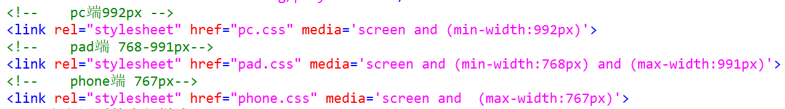

## 第三十三天学习  12.17  
### 一、复习  
### 二、今日内容  
#### 1.过渡  
某元素的css属性在一段时间内，平滑改变到另外一个值  
过渡只要观察的是过程和结果  
设置能够过渡的属性:  
颜色的属性   
取值为数值  
transform  
渐变属性   
visibility  
阴影   
指定本次过渡的属性:   
transition-property:上面的css属性  /all  
指定过渡的时长  
transition-duration:过渡的时长3/s/ms  
指定过渡时间曲线函数  
transition-timing-function :    
+ ease 默认值,慢-快-慢  慢速开始 快速变快 慢速结束
+ linear 匀速  
+ ease-in  慢-快 慢速开始，快速结束  
+ ease-out 快-慢   快速开始，慢速结束  
+ ease-in-out 慢速开始     先加速，在减速 ，慢速结束     
指定延迟执行过渡的时间    
transition-delay    
过渡属性的编写位置  
1.将过渡属性放在元素声明的样式中(元素自己的样式里),过渡效果有去有回  
2.将过渡效果放在元素的出发操作中(hover),过渡效果有去无回  
过渡的简写：  
transition:property duration timing-function delay ;  
最少的简写方式：transition:duration;  
练习：翻滚吧，牛宝宝  [练习](exercise/02_ex.html)
#### 2.动画  
使元素从一种样式,改变到另外一种,再改变到其他样式...    
相当于将很多个过渡效果放在一起使用  
关键帧：  
+ 1.动画的执行时间点  
+ 2.该时间点上的样式  
动画的实现步骤：  
+ 声明动画及动画关键帧  
@keyframes 动画名称{
    //定义动画关键帧  
    0%{动画开始时的样式}  
    ... 
    100%{动画结束时的样式}  
}  
+ 调用动画  
animation-name:动画名称  
animation-duration:动画播放一个周期的时间  
+ 动画的其他属性  
animation-delay  
+ 动画的速度时间曲线函数  
animation-timing-function   
ease/linear/ease-in/ease-out/ease-in-out    
+ animation-iteration-count  
指定动画的播放次数  
取值，具体的数字/infinite无限次  
+ animation-direction:  
动画的播放方向  
取值normal正常播放  0~100%
reverse逆向播放  100%~0%  
alternate轮流播放  &emsp;奇数次正向播放，偶数次逆向播放  
简写：  
animation:name duration  timing-function  delay iteration-count  direction;  
+ animation-fill-mode  
指定动画播放前后的显示状态  
    + none 默认值  
    + forwards 动画完成之后，保持在最后一个关键帧上  
    + backwards(需要有delay)动画开始之前,保持在第一个关键帧上  
    + both,同时设置forwards和backwards   
动画的兼容：  
@keyframes 动画名称 {}   
@-webkit-keyframes  
@-moz-keyframes  
@-o-keyframes  
#### 三、CSS 优化    
##### 1.css优化
目的：减少服务器压力，提升用户体验  
+ 1.优化原则  
尽量减少HTTP请求的个数  
页面顶部引入CSS文件  
将css和js放到外部独立的文件夹中  
+ 2.css代码的优化  
减少样式文件  
减少样式的重写  
避免出现空的src和href  
选择更优的样式属性值(能使用复合，) 
##### 2.Bootstrap  
www.bootcss.com  
+ 2.1响应式布局(重点)  
Responsive web page响应式/自适应的网页  
可以根据浏览器的设备不同(pc/pad/phone)  
自动调用对应的布局,图片,文字效果,从而不会降低用户体验    
+ 2.2响应式网页必须做到的前提  
    + 布局：不能固定宽度，必须是流式布局(尽量少用定位,可以浮动)  
    + 文字和图片，大小随着容器大小而改变 em rem   
+ 2.3媒体查询技术(属于css3/html5)  
响应式网页存在的问题:      
页面的复杂度地大的增加    
只适用于内容不太多的页面(企业的官网,门户网站)  
媒体查询技术属于html5/css3的技术  
boot把媒体查询这件事，封装了，不需要我们自己写了  
##### 3.如何测试响应式网页  
+ 3.1使用真实设备测试  
好处：真实并且可靠  
缺点：测试任务量巨大  
+ 3.2使用的第三方的模拟测试软件  
好处：无需添置真实设备,测试方便  
缺点:测试效果有限,有待进一步验证(比如蓝牙/NFC)   
+ 3.3使用浏览器自带的模拟器测试  
好处：简单方便  
缺点：测试效果有限，需要进一步验证  
##### 4.如何编写响应式布局    
+ 4.1  
```
    元数据  
    在元数据标签中定义viewport---视口  
    name='viewport'  
    content设置能够允许网页进行的操作  
    width=device-width表示视口宽度就是设备宽度  
    initial-scale=1表示视口宽度是否可以缩放，1.0不能缩放
    maximum-scale=1.0允许缩放的最大倍率  
    user-scalable=0是否允许用户手动缩放yes/no/1/0  
    一般设置：
    <meta name="viewport" content="width=device-width, initial-scale=1">   
```      
+ 4.2所有的内容、文字、图片，使用相对尺寸，不能使用10px这种绝对的值   
+ 4.3  流式布局+弹性布局，在搭配媒体查询技术来完成响应式布局  
float flex  
+ 4.4使用css3 Media Query技术做响应式网页  
Media:媒体，浏览网页的设备    
如:screen(pc/pad/phone) tv print    
Media Query：媒体查询，可以自动根据当前浏览器设备的不同( 尺寸，解析度，方向不同),有选择的执行一部分css而忽略其他部分的css   

      

注意：此方案使用较少  
所有的css文件都会被加载,每个css文件中,存在很多重复的代码  
根据媒体查询的结果,执行同一个css文件下的不同代码块  
作业：  
+ 1.使用响应式完成以下作业   
+ 2.提高作业bootstrap部分首页  


