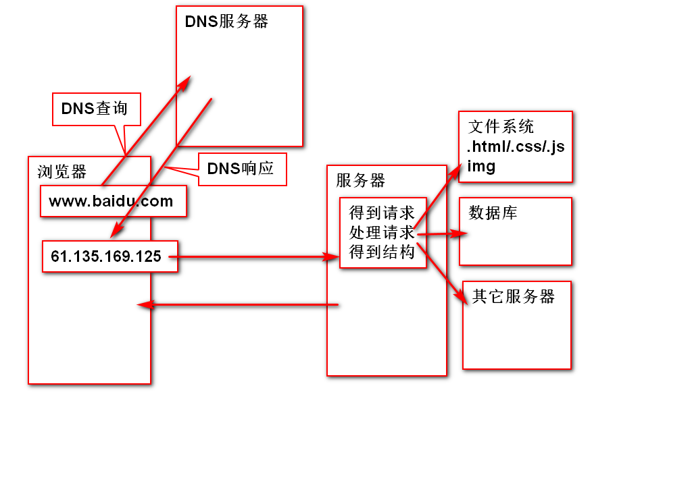
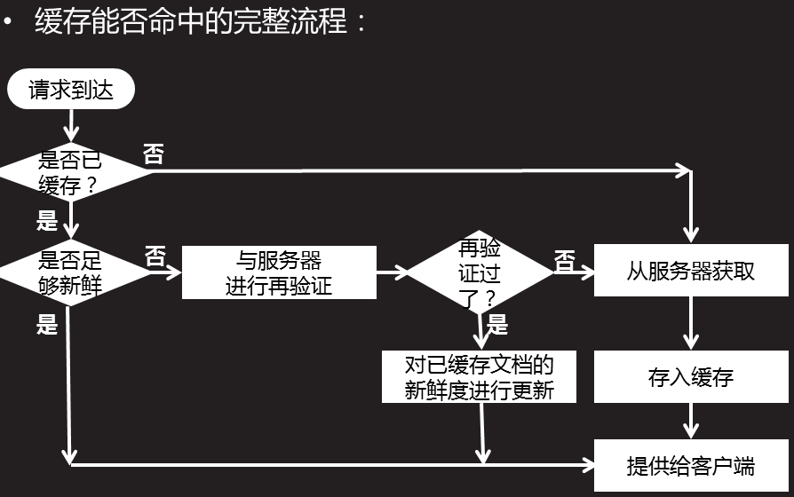

## 第二十三天学习  12.3  
#### 一、复习    
#### 二、今日内容  
##### 1.同步---(一心一意)  
只能做一件事件，这件事情做完才能做下一件事    
##### 2.异步---(三心二意)  
能同时做很多事儿 
##### 3.Ajax的异步加载 ---HTTP协议  
+ 3.1url     
```    
结构:协议+主机名称+端口+目录结构+文件名称    
http://www.codeboy.com/admin/index.html  
```  
<font color='red'>url完整的结构 (必备)  </font>  

```
<scheme>://<user>:<pwd>@<host>:<port>/<path>;<params>?<query>#<frag>   
scheme:方案、协议，以哪种方式获取浏览器的资源  
不区分大小写，常见协议,http/https/ftp   
user:用户名  
pwd:密码  
host:  主机号  localhost  127.0.0.1  
port:端口号  
path:资源在服务器上存放的位置  
params:参数，服务器端使用   session、cookie  
query:查询字符串  ?uname=lilei&upwd=123456  
frag:锚点  #锚点名称   
```  
|常见的协议 | 默认端口号  |  基本作用
|----|----|----| 
ftp       | 21        | 文件的上传下载
SSH       |22         |  安全的远程登录 
telnet    | 23         |远程登录   
SMTP| 25|邮件传输  
DNS|53|域名解析  
<font color='red'>HTTP </font> |80|超文本传输协议 
 POP3|110|邮件接收协议  
<font color='red'>HTTPS </font> |443|加密的传输http    
+ 3.2HTTP 协议  
HTTP:HyperText Transfer Protocol超文本传输协议  
规范了数据是如何打包以及传递的  
http的历史  &emsp;&emsp; 现在使用的版本是http/1.1---不需要设置    
1991年制定的http/0.9    
1999年制定较稳定的版本http/1.1    
+ 3.3详解 (见下图)   

 
+ 3.4 Request  

HTTP协议规定，客户端与服务器端传递的数据块Message(消息/报文)。必须符合特定的格式，这个Message才能被客户端和服务器彼此理解  
    + 请求消息(请求起始行，请求头，请求主体)---Requst    
    浏览器要发送给服务器的数据
    + 响应消息(响应起始行，响应头，响应主体)---Response
    服务器发送给浏览器的数据  
<h4 style='color:#f66'>Requset请求消息</h4>  
客户端要发送给服务器的数据,由三部分组成，请求起始行、请求头、请求主体   

<font color='red'>3.4.1请求起始行：  
- 请求方法  
- 请求url  
- 协议版本  
</font>  


+ 3.4.1.1请求方法：  
+ (1)get 客户端向服务器要数据的时候使用   
特点：靠地址栏传递查询字符串。<font style='color:#f66'>无请求主体</font>   
+ (2)post 客户端向服务器提交数据的时候使用   
特点:隐式发送数据 。<font color='#f66'>有请求主体(form  data)</font>   
+ (3)delete 表示客户端可以删除服务器上的内容(一般禁用)  
+ (4)put表示客户端可以往服务器上放数据   
+ (5)connect 测试连接  
+ (6)trace追踪请求路径 
+ (7)option选项  
+ (8)head 表示客户端只获取响应消息头  
观察请求主体的操作：  
一个form，文本框，密码框，提交按钮  
如果使用get方法，直接通过明文发送数据 
如果使用post方法，在network中有form data    这一项  。  
通过请求主体把数据隐式传送给服务器。  
注意：get和post传输数据的格式，很相似。   
+ 3.4.1.2url访问的地址链接   
+ 3.4.1.3协议版本 http/1.1    
+ 3.4.2请求头---Request Headers  
host:告诉服务器，请求的是哪一个主机 
Connection:keep-alive告诉服务器进行持久连接   
User-Agent:告诉服务器自己(浏览器)的类型   
Accept-Encoding:gizp,deflate:告诉服务器，自己所能接收的压缩文件类型  
Accept-Language:告诉服务器自己能接收的自然语言的类型  
Referer:引用/推荐人，告诉服务器请求来自哪个网页。  
+ 3.4.3请求主体---post---form data   
+ 3.5Response   
<h4 style='color:#f66'>Respanse 响应消息</h4>  
服务器发送给客户端的数据，由三部分组成:响应起始行、响应头、响应主体    

<font color='red'>3.5.1请求起始行：  
- 协议版本   
- 响应状态码 
</font>    
响应状态码：告诉客户端(浏览器),服务器的响应状态是什么   
取值:  
1XX:100~199  提示信息  
  
    <font color='red'>2XX:成功响应  200 ok  </font>  

     3XX: 
        &emsp;301 永久重定向  
        &emsp;&emsp;&emsp;302临时重定向  
        &emsp;&emsp;&emsp;304请求未被修改，还是原来的请求，命中缓存  

    <font color='red'>4XX:客户端请求的错误  </font>  
        <font colr='red'>&emsp;&emsp;&emsp;404  Not Found 请求资源不存在  </font>   
        &emsp;&emsp;&emsp;403 Forbidden 权限不够  
        &emsp;&emsp;&emsp;405 Method not Allowed请求方法不被允许  

    <font color='red'>5XX:服务器运行错误 </font>   
    解决错误方式：  
        404：检查url是否正确，要访问的资源是不是在url指向的位置  
        (html位置，和路由)  
        5XX： 检查接口中的代码是否正确   

3.5.2响应头  
Date：告诉浏览器，服务器的响应时间，格林威治时间 +8h是北京时间  
Connection:告诉浏览器已经启动了持久连接    
Content-Type:响应主体的类型  
    text/html 响应回来的数据是html文本  
    text/plain普通文本    
    text/css响应样式文本  
    application/x-javascript  js文件  
    image/png/jpeg/gif响应回来的是一个图片    
    <font color='purple'>  
    application/json 响应回来的是json格式的字符串  
    application/xml  响应回来的是xml格式的字符串   
    </font>   
    3.5.3响应主体   响应回来的数据  
    network中,在header的 右边第二个   
##### 4.缓存     
浏览器如何使用缓存工作流程：  如下图：  

4.1缓存的优点  
+ 减少冗余的数据传输，节省客户端的流量    
+ 节省服务器的带宽  
+ 降低了对服务资源的消耗和运行需求  
+ 降低了远距离传输而造成的延迟加载     

4.2缓存工作原理： 如下图：  

   
  
(1)请求--无缓存--访问服务器--存缓存--客户端得到数据  
(2)请求--有缓存--够新鲜--命中缓存--客户端得到数据  
(3)请求--有缓存--不新鲜--访问服务器，看是否过期--没过期--更新缓存的新鲜度  
(4)请求--有缓存--不新鲜--访问服务器，看是否过期--以过期--访问服务器--存缓存--客户端得到数据  
4.3与缓存相关的消息头  
Cache-Control:http1.1从服务器将文档传到客户端之时起，此文档处于新鲜的秒数，这个秒数是一个相对时间  
语法：0 不缓存    
    max-age=新鲜的秒数  
Exprires http1.0用法  
指定过期的时间是一个具体的时间点  
4.4网页中如何添加缓存  
```  
    <meta http-equip='消息头' content='消息头的值'>  
    <meta http-equip='Cache-Control' content='max-age=3600'>
```    
4.5HTTP性能优化   
1.http连接的过程  
发起请求->建立连接->处理请求->访问得到相应资源->得到结果，构建响应->发送响应->记录日志   
2.http连接性能优化的思路 
减少请求次数  
减少连接的创建次数(开启持久连接) 
提高服务器端的运行速度  
尽可能减少响应数据的长度  
3.安全的http协议  
https，安全版本的http  
SSL:为数据通信提供了安全支持  
<font color='green'>   
客户端发送请求消息时，在SSL层加密  
服务器接收到加密文件，在SSL层解密  
得到请求明文，对请求进行处理   
</font>  
<font color='blue'> 
服务器发送响应消息，在SSL层加密  
客户端接收到加密文件，在SSL层解密  
得到响应明文，解析相应内容    
</font>    
<h2 style='color:pink'>5.DOM操作</h2>
<b>5.1完整的javascript操作的组成</b>   

js核心：ECMA Script   ECMA--欧洲计算机制造联合会    
DOM:Document Object Model 文档对象模型    
让js动态的操作页面上的元素    
  
BOM: Browser Object Model 浏览器对象模型  
让js动态的操作 浏览器  
DOM，这个阶段就学习获取页面上的元素，改变这个元素的内容。  
5.2简单的DOM操作  
+ 获取的元素一定要有id属性    
```  
<div id='d1>这是测试的文本</div>  
```  
+ 在js中，用id获取对象  
```  
document.getElementById('d1');   
```   
+ 获取/设置元素的内容innerHTML    
```
d1.innerHTML=...  
var str=d1.innerHTML;    
```    
<i style='color:hotpink'>
innerHTMl指的是双标签，开关标签之间的所有内容。 
如果开关标签之间有其他元素，会得到该元素的文本字符串  
如果设置innerHTML时，添加了新标签，在语法正确的情况下，新标签也会在页面上渲染。  
</i>   

H5支持简写方式：  
d1就是div对象   
+ 事件  ---用户与页面的交互行为，调用什么代码  

作业：  
1.在网页中创建一个div,内容随意  
添加一个按钮，点击时获取div中文本并打印在控制台，再添加一个按钮，点击时将div中文本内容修改 [练习1](03_homework.html)   
2.添加一个按钮，在div中动态生成一个3*3的，内容随意的表格[练习2](04_homework.html)  